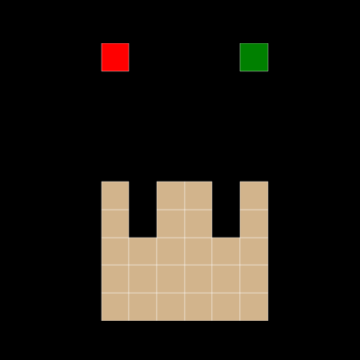

# autumn_py

Autumn's reactive grid-world semantics, embedded in Python as a DSL on top of
[`effectful`](https://github.com/BasisResearch/effectful).

<p align="center">
  
</p>

## What this is

[Autumn](https://github.com/BasisResearch/Autumn.cpp) is a small Lisp-shaped
reactive language for grid-world programs — particles, Game of Life, Mario,
falling sand, that kind of thing. The canonical implementation is a C++
interpreter with pybind11 bindings.

This repo is a Python port, but it's not just a re-interpreter of the
s-expression syntax. It's the **same semantics re-expressed as a Python DSL**,
with every side effect (state read/write, `prev`, randomness, object IDs, event
flags, rendering) exposed as a `@defop` operation handled by layered
`ObjectInterpretation`s from `effectful`. You write Autumn programs as Python
files; `effectful` is the substrate that runs them.

The payoff is the usual algebraic-effects one: the same program runs under
different handler stacks. Today that's "ground execution with a seeded RNG";
tomorrow it can be deterministic replay, tracing, or symbolic mode for program
synthesis — without touching the programs themselves.

## A program, end-to-end

The canonical `particles.sexp` from upstream, ported:

```python
from autumn_py import Cell, Position, StateVar, click, clicked, obj, on, prev, program
from autumn_py.stdlib import addObj, adjPositions, updateObj, uniformChoice


@obj
class Particle:
    cell = Cell(0, 0, "blue")


@program(grid_size=16)
class Particles:
    particles = StateVar(list, init=[])

    @particles.next
    def _():
        return updateObj(
            prev(Particles.particles),
            lambda o: Particle(uniformChoice(adjPositions(o.origin))),
        )

    @on(clicked)
    def _():
        Particles.particles.set(
            addObj(prev(Particles.particles),
                   Particle(Position(click.x, click.y)))
        )
```

Run it:

```python
from autumn_py import Runtime
r = Runtime(Particles, seed=42)
r.click(3, 4); r.step()
print(r.render_all())
# [{'x': 3, 'y': 4, 'color': 'blue'}]
```

Every call inside those method bodies — `uniformChoice`, `adjPositions`,
`addObj`, `prev(...)`, `.set(...)` — resolves to an `effectful` op under the
handler stack the `Runtime` installs.

## Install and run the interactive player

```bash
python3.12 -m venv .venv
.venv/bin/pip install -e .
```

Matplotlib is an optional dep for the player. If you want to play with it:

```bash
.venv/bin/pip install matplotlib
.venv/bin/python examples/player.py sand      # or mario, particles, ants, game_of_life, grow
```

Click / arrow keys go to the running program. `q` quits.

## The effect surface

Every world-touching operation is a `@defop` that raises `NotHandled` by
default, so evaluating a program with no handlers installed builds free
`Term`s — symbolic mode is a handler swap away. The persistent handler stack
is:

| Handler | Implements | Notes |
|---|---|---|
| `StateHandler` | `get_var`, `set_var` | live `_globals`; distinguishes init/commit/on-clause writes |
| `NativeRandomHandler(seed)` | `sample_uniform` | swappable for `ReplayRandomHandler(draws)` |
| `ObjectAllocHandler` | `alloc_obj_id` | monotonic ids |
| `RenderHandler` | `emit_render_cell` | accumulates cells per `render_all()` |
| `WorldHandler` | `all_objs`, `grid_size`, `state_has` | whole-world queries |

Per-tick, the `Runtime.step()` loop layers three more:

| Handler | Lifetime | Notes |
|---|---|---|
| `PrevStateHandler(snapshot)` | one tick | frozen `MappingProxyType` — `prev(...)` reads this |
| `make_event_intp(active, click_pos)` | one tick | event lookups via `coproduct` |
| `WriteBufferHandler` | on-phase only | buffers on-clause `set_var`; flushes into `apply_buffered` which populates `on_writes_this_tick` (that's what decides which default next-expressions skip) |

Next-expressions run afterwards in declaration order; a next-expr may
legitimately `set_var` on sibling state vars (Autumn's `(=)` is an expression),
and those writes go straight through without populating the skip set.

The structural list combinators are effects too: `map_op`, `filter_op`,
`concat_op`, and `adjPositions_op` are `@defop`s, and the Autumn-level
`addObj` / `removeObj` / `updateObj` are plain Python compositions of them.
That keeps the kernel small — `TypeOfHandler` and any future symbolic /
reduction handler only need to interpret the combinators, not every
Autumn-named primitive — and lines up with §6.1.1 of the PL writeup
(MAP-DECOMP / FILTER-DECOMP / ADD-DECOMP), where the inference pipeline
decomposes the higher-level list rules into the same kernel.

## What's ported

Six envs from [Autumn.cpp/tests/](https://github.com/BasisResearch/Autumn.cpp/tree/main/tests)
run end-to-end:

| Example | LOC | Notes |
|---|---:|---|
| `particles.py` | ~25 | random-walk particles, click to spawn |
| `game_of_life.py` | ~90 | 16×16 Conway's; green button advances, silver resets |
| `ants.py` | ~55 | unit-vector pursuit, click spawns food |
| `mario.py` | ~180 | gravity, patrol, shooting, coins, enemy lives |
| `grow.py` | ~130 | falling water, leaves grow up, cloud drifts under the sun |
| `sand.py` | ~140 | granular + fluid physics, liquefaction on contact |

The remaining envs in the upstream tests directory (bbq, disease, egg, sokoban,
space_invaders, etc.) are mechanical ports once the stdlib they touch is
added.

## Layout

```
autumn_py/
  ops.py               every @defop (all NotHandled by default)
  api.py               @program, @obj, @on, StateVar, prev()
  values.py            Cell, Position, ObjectInstance (with named fields)
  events.py            clicked/left/right/up/down sentinels, click pseudo-object
  stdlib.py            native helpers: uniformChoice, updateObj, moveLeft..,
                       intersects, closest, unitVector, nextSolid, nextLiquid, ...
  runtime.py           Runtime: handler composition, tick loop, render_all
  handlers/
    state.py           live env, split write tracking
    prev.py            read-only frozen snapshot
    writes.py          on-clause write buffer
    random.py          Native / Replay
    events.py          per-tick event Interpretation
    objects.py         id allocator
    render.py          cell accumulator
    world.py           all_objs / grid_size / state_has
examples/              particles, ants, mario, game_of_life, grow, sand, player
tests/                 47 tests covering laws + per-env smoke
```

## What's deliberately missing

- **No s-expression parser.** You write programs as Python. An optional
  `sexp/` bridge could translate `.sexp` to this DSL in the future, but it's
  not in the critical path and no test depends on it.
- **No symbolic / trace / replay modes wired up yet.** The `NotHandled`
  discipline keeps that door open; stubs in `modes.py` will fill in.
- **Lightweight type checker.** We enforce Autumn's `(: x T)` annotations
  along the load-bearing axes of §2 of the PL writeup:
  - **State-var init values, `@obj` field values, initializer + next-expression return values** — runtime isinstance checks.
  - **Parameterised lists (`list[T]`)** — element-wise checked.
  - **`@obj` classes** — instance must match the declared factory's spec.
  - **`@on` predicate** — must return `bool`, not just truthy.
  - **Cell color closures** — must return `str` at render time.
  - **`@.next` / `@.initializer` function return annotations** — checked at decoration time against the StateVar's type.
  - **`prev()` on an unbound StateVar** — raises immediately rather than later through a confusing `NameError`.

  `object` annotations remain permissive (universal). Higher-order generics beyond `list[T]` pass through. `uniformChoice`'s parametric return type is the one substantive remaining gap — it would need true type-inference. See `autumn_py/api.py::_check_type` and `tests/test_type_checker.py`.

## Credits

- Ria Das's original Autumn language and reference implementations:
  [riadas/Autumn.jl](https://github.com/riadas/Autumn.jl) (Julia) and
  [riadas/Autumn.js](https://github.com/riadas/Autumn.js) (JavaScript).
- [BasisResearch/Autumn.cpp](https://github.com/BasisResearch/Autumn.cpp) —
  the C++ reimplementation and the example programs ported here.
- [BasisResearch/effectful](https://github.com/BasisResearch/effectful) —
  algebraic effects and handlers for Python.
